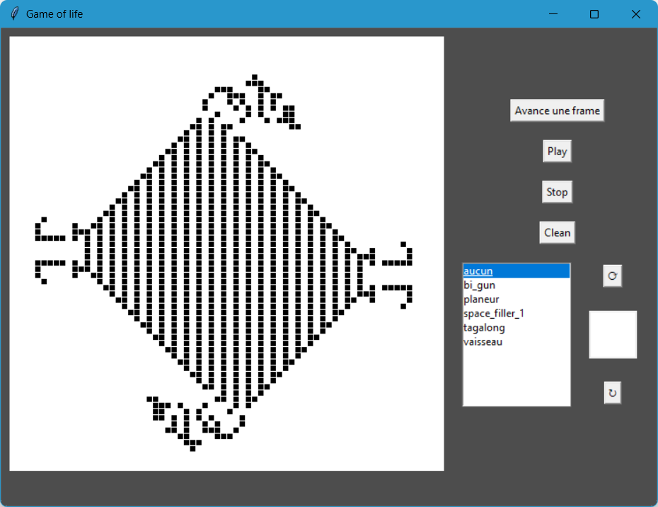
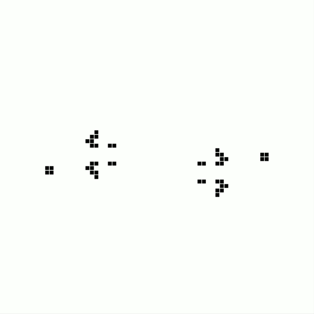

# Simulateur du jeu de la vie

Voici un programme de simulation du jeu de la vie

## Presentation du jeu de la vie 
Le <a href="https://fr.wikipedia.org/wiki/Jeu_de_la_vie">jeu de la vie</a> (Game of life) est un automate cellulaire à deux etat.
Inventer par le celebre mathematicien <a href="https://fr.wikipedia.org/wiki/John_Horton_Conway">John Horton Conway</a>
Ou chaque case d'une grille en deux dimensions est une cellule qui peut etre vivante ou morte.
À chaque iteration, l'état d'une cellule est definie par l'état des ces huit voisines.

## Mon Logiciel

Ce programme permet d'inverser l'état des cellules par un simple clic.
Mais aussi de selectionner des modèles de base et de les placer librement.
Vous pouvez avancer iteration par iteration ou bien appuyer sur le boutton play pour lancer une
boucle d'iteration. Pour l'arrêter, appuyer sur le boutton stop. Le boutton clean sert à mettre à zeros
la grille.

Exemple du model deja enregister "bi gun": c'est une structure repetitive qui cree des "planeur"

